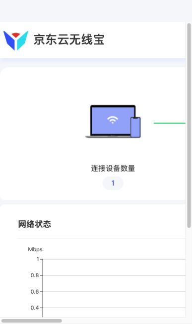
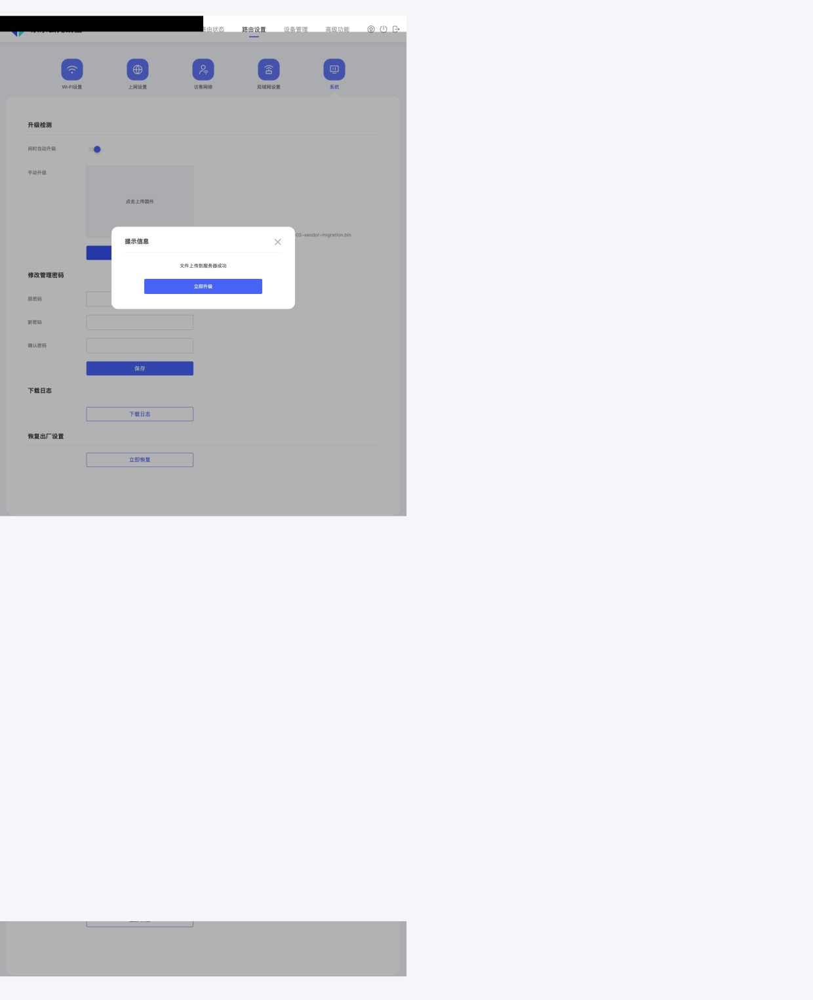
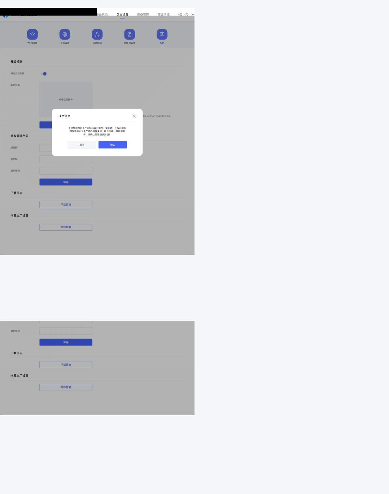
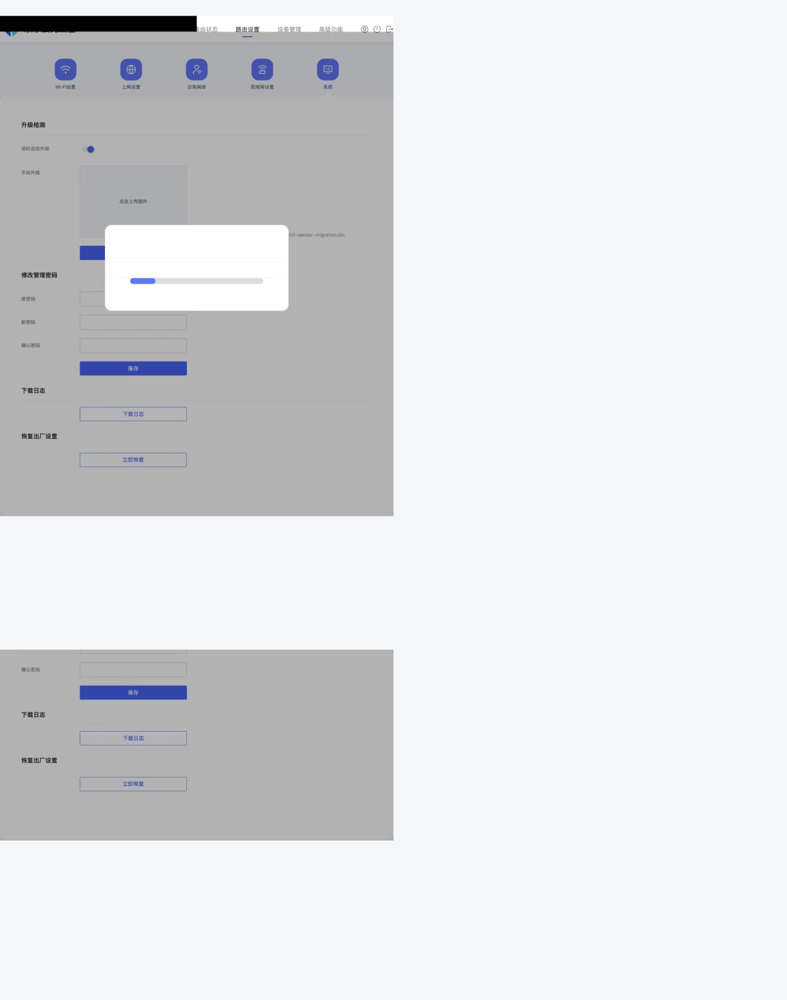

# 京东云 AX6000 百里刷官方 OpenWrt 通用教程

[](https://creativecommons.org/licenses/by-nc-sa/4.0/deed.zh)

> **刷机有风险，操作需谨慎。** 本教程基于两台真机（128G RE-CP-03 + 64G RE-CS-05 尊享版）实测整理，
> 每一步都有验证点；但每个人的网络环境和设备状态不同，作者不对刷机后果负责。
> **分区备份（尤其 factory 校准分区）属一机一份的敏感数据，请勿公开传播，本仓库也不包含任何分区备份。**

## 诞生记：一位 50 多岁爱好者的「AI 自动刷机」

以前手动刷机意味着什么，老玩家都懂：翻帖找资料、一行行敲命令、备份完对哈希对到眼花、
TFTP 不通守着电脑熬夜排查，手一抖就是一块砖。
而这一次，作者只对 AI 代理下了一句指令：「把这台百里刷成官方 OpenWrt」——
两台机器的刷机**全程由 AI 代理在用户授权下直接实操**：
通过 SSH 登录过渡系统与恢复系统，自动完成分区备份、两侧哈希逐项比对、GPT/BL2/FIP 写入与读回校验、
macOS 临时 TFTP 服务搭建、恢复网段路由排障，直到 sysupgrade 安装正式系统与验收。

人只负责四件事：在网页上点确认、插拔电源、提供管理密码，以及在「验证点」不过时叫停。

文末「坑与排查速查」的 13 条全部来自这次 AI 实操中的真实翻车与现场修复——
例如 TFTP 反复 `receive_packet: timeout`，是 AI 从 tftpd 日志反推路由表、
定位到「同网段双网卡回包走错接口」这一根因的。教程里的每条命令、每个哈希、每个时间点，都有当次会话的操作记录可查。

## 仓库结构

| 路径 | 内容 |
|---|---|
| `README.md` | 通用教程正文（64G/128G 双容量实测） |
| `scripts/` | 分区备份、官方引导写入、macOS TFTP 恢复服务等脚本（敏感值已占位，按注释填本机值） |
| `firmware/` | 固件获取来源与 SHA-256 校验清单（**不分发二进制**） |
| `images/` | 过程截图（已逐张检查，不含密码/MAC/序列号） |
| `docs/` | 恩山论坛发布版（Discuz BBCode） |
| `optimization/` | **优化配置篇**：刷完之后的全部优化配置文档（中文/扩容/NAS/拨号/SQM/美化/压测）、eMMC 监控脚本与实操截图 |

## 教程正文


> 版本：2026-10-01 整合版。本教程由两台真机的完整刷机档案整合而成：
> 128G（RE-CP-03，JDCOS 4.2.0.r4080）与 64G（RE-CS-05 尊享版，JDCOS 4.3.0.r4204），
> 每一步都在真机上验证过，所有哈希、命令、时间点均可追溯。

---

## 一、适用范围

| 项目 | 说明 |
|---|---|
| 适用型号 | 京东云无线宝 AX6000 百里：**RE-CP-03**、**RE-CS-05**（同一硬件，固件通用；RE-CS-05 后台自报型号也是 RE-CP-03） |
| 存储版本 | **64GB / 128GB eMMC 均可**（官方同一套镜像，流程仅两处数字不同，见文中标注） |
| 目标系统 | OpenWrt 官方稳定版 25.12.5（mediatek/filogic） |
| 原厂版本 | 实测 JDCOS 4.2.0.r4080 与 4.3.0.r4204 均可 |
| 不适用 | 京东云鲁班 RE-CP-02、雅典娜、哪吒等其他型号；小米/红米 AX6000 |

**硬件规格**：MT7986A 四核 A53、1GB DDR4、64/128GB eMMC、4×千兆 + 1×2.5G（WAN）、MT7976C 双频 Wi-Fi 6。

**原理**：原厂 JDCOS 不允许直接刷第三方固件。先用官方放出的迁移包刷入过渡版 OpenWrt（4.1.0.r4005）获得 root，再替换引导（GPT/BL2/FIP）为官方版本；断电后新 U-Boot 自动经 TFTP 拉取恢复系统，最后在恢复系统中 sysupgrade 安装正式版。

**总流程**（全程约 1 小时，不含排查时间）：

```
原厂后台刷迁移包 → 过渡系统 → 备份全部分区 → 写官方 GPT/BL2/FIP
→ 断电上电 → U-Boot 经 TFTP 启动恢复系统 → sysupgrade 装正式版 → 验收配置
```

**核心纪律：每一步都有「验证点」，验证不过就停，不要进入下一步。**

---

## 二、准备

### 硬件
- 电脑一台（本教程命令以 Mac 为例；Windows 差异处在 TFTP 一节说明）
- 网线两根：电脑 → 百里千兆 LAN；收尾时 上级路由 → 百里 2.5G WAN
- 供电稳定，刷写期间绝不断电

### 固件文件（6 个）与哈希

迁移包（过渡用；官方提交给出的链接，公开教程均使用同一文件）：

| 文件 | SHA-256 |
|---|---|
| openwrt-mediatek-mt7986-jdcloud_re-cp-03-vendor-migration.bin | `c371601461c491489d2f28391ee3373e4605f95ff5d16cf7d142b9b2031a444c` |

官方 25.12.5（下载自 https://downloads.openwrt.org/releases/25.12.5/targets/mediatek/filogic/ ，文件名前缀均为 `openwrt-25.12.5-mediatek-filogic-jdcloud_re-cp-03-`）：

| 文件后缀 | SHA-256 |
|---|---|
| gpt.bin | `6decc5e0ac9ef38bc78f4de8d4df825473a248898c24add4252cd74006f2fd20` |
| preloader.bin（BL2） | `d1f272a3a5d474bafdc40bf4a99749304185f12dd799f87c414964b88dd3e72e` |
| bl31-uboot.fip（U-Boot） | `52a5e4904488a35d680fbe379b8d90935c683628c3d082ae4823e44cd09c1724` |
| initramfs-recovery.itb（恢复镜像） | `ecd5b00a505ec57550bf1a4b92d7fda5a7b4944693768963c0c27ec8a054ba59` |
| squashfs-sysupgrade.itb（正式系统） | `cfbe6baca9d2cede824632b9faca00a361871c480f23143a20e386e0cf535c7f` |

刷前逐个核对哈希（Mac/Linux：`shasum -a 256 文件`；Windows：`Get-FileHash 文件`）。对不上就重新下载，不要硬刷。

### 网络环境检查（两台机器都在这一步翻过车，务必读）

**电脑上同一时间只能有一个接口处于 192.168.1.0/24 网段。**

- 家里主路由如果就是 192.168.1.1（很多 OpenWrt 默认如此）：先把主路由 LAN 改成别的网段（如 192.168.66.1），或刷 TFTP 恢复期间断开电脑与主路由的连接。
- 关闭 VPN、ZeroTier、虚拟网卡等。
- macOS「系统设置 → 网络 → 服务顺序」**不影响**直连路由的选择，不能靠它解决冲突。
- 原理：TFTP 回包按路由表选择出口，同网段有两张网卡时回包会走错接口，U-Boot 永远收不到数据。

---

## 三、第一步：确认设备（只读，5 分钟）

1. 网线连接电脑与百里任意千兆 LAN 口。
2. 浏览器打开 `http://192.168.68.1`（或 jdcloudwifi.com），用管理密码登录。
3. 状态页记录原厂版本号（JDCOS-x.x.x.rxxxx）。
4. 进阶确认（免登录）：访问 `http://192.168.68.1/conf/product_platform.json`，应返回 `"model": "RE-CP-03"`（RE-CS-05 同样显示 RE-CP-03，这是两者通用的设备侧铁证）。

**验证点**：能进后台；型号为 RE-CP-03。不符即停，不要刷相近型号的固件。




---

## 四、第二步：刷入迁移包（约 10 分钟）

1. 完整后台进入：**路由设置 → 系统 → 手动升级**。


   - ⚠️ 顶部「在线升级」是厂商在线更新通道，不能刷迁移包。
2. 「点击上传固件」选择迁移包 → 点页面下方「升级」。
   - 这一步仅上传到 /tmp（前端限制 60MB，迁移包约 26MB）。
   - 显示「文件上传到服务器成功」。



3. 点「立即升级」→ 弹出**非官方固件提示** → 确认继续。
   - ⚠️「立即升级」不是验证按钮，点了就进入刷写流程（前端逻辑：`firmware_check` 返回 100 → 提示 → 确认后 `local_upgrade_action`）。想好再点。



4. 页面提示「固件升级需要 3-5 分钟，请勿切断电源」。**保持供电，不刷新、不拔电。**



5. 等待重启（ping 中断约 30 秒～1 分钟）。

**验证点**（约 5 分钟后）：
- `http://192.168.68.1` 出现 OpenWrt LuCI 登录页。


- SSH `root@192.168.68.1`（无密码）执行：
  ```sh
  cat /etc/openwrt_release | head -3   # 4.1.0.r4005，mediatek/mt7986
  cat /tmp/sysinfo/board_name          # mediatek,mt7986a-emmc-re-cp-03
  ```
- 过渡系统时钟可能停在 2022 年（未对时），正常，时间以电脑为准。

---

## 五、第三步：备份（约 15 分钟，最重要）

**进过渡系统后第一件事就是备份。** 它是防砖保险，也保住每台机器独一无二的无线校准数据。

1. 现场读取存储参数（**必须实测，两种容量数字不同**）：
   ```sh
   cat /sys/class/block/mmcblk0/size       # 64G=119783424；128G=241664000
   cat /sys/class/block/mmcblk0boot0/size  # 8192
   cat /sys/block/mmcblk0/mmcblk0p3/start  # factory 起始，9216
   cat /sys/block/mmcblk0/mmcblk0p3/size   # factory 长度，4096
   ```
2. 电脑上执行备份（Mac/Linux；过渡系统无 sftp-server，scp 不可用，一律用 SSH 管道）：
   ```sh
   mkdir -p 备份 && cd 备份
   for dev in mmcblk0boot0 mmcblk0boot1 mmcblk0p2 mmcblk0p3 mmcblk0p4 \
              mmcblk0p5 mmcblk0p6 mmcblk0p7 mmcblk0p8; do
     ssh root@192.168.68.1 "sha256sum /dev/$dev" | tee -a 设备端-sha256.txt
     ssh root@192.168.68.1 "dd if=/dev/$dev bs=1048576 2>/dev/null" > "$dev.bin"
   done
   ssh root@192.168.68.1 'dd if=/dev/mmcblk0 bs=512 count=34 2>/dev/null' > gpt-primary.bin
   # 末尾 33 扇区：64G 用 skip=119783391；128G 用 skip=241663967
   ssh root@192.168.68.1 'dd if=/dev/mmcblk0 bs=512 skip=119783391 count=33 2>/dev/null' > gpt-backup.bin
   shasum -a 256 *.bin > 电脑端-sha256.txt
   ```
3. **逐项比对**两侧哈希，全部一致才算完成。

**验证点**：
- 9 份分区镜像 + 2 份 GPT 双侧一致。
- **单独记录 factory（mmcblk0p3）的哈希**：它是本机无线校准与 MAC 地址，一机一份。**绝不跨机使用**——实测两台机器的 factory 哈希不同，而 boot0/boot1/fip 两台完全相同（原厂引导是同型号通用镜像）。
- 可选：打包 /overlay、/log、/opt、storage 文件（运行中归档，非整盘快照）。

---

## 六、第四步：写入官方 GPT / BL2 / FIP（约 5 分钟）

> 百里 BL2 开启 Secure Boot 校验，**BL2 与 FIP 必须成对替换**，只换 FIP(U-Boot) 会无法启动。

1. 三个官方文件上传路由器 /tmp（SSH 管道），设备端 `sha256sum` 与官方清单逐项核对。
2. 在路由器 /tmp 执行写入脚本（**64G/128G 仅第一行扇区数不同**；FACTORY 换成本机第五步记录的哈希）：

```sh
#!/bin/sh
set -eu
cd /tmp
P=openwrt-25.12.5-mediatek-filogic-jdcloud_re-cp-03
[ "$(cat /sys/class/block/mmcblk0/size)" = 119783424 ]   # 64G；128G 改为 241664000
[ "$(cat /sys/class/block/mmcblk0boot0/size)" = 8192 ]
grep -q 're-cp-03' /tmp/sysinfo/board_name
printf '%s\n' \
"6decc5e0ac9ef38bc78f4de8d4df825473a248898c24add4252cd74006f2fd20  $P-gpt.bin" \
"d1f272a3a5d474bafdc40bf4a99749304185f12dd799f87c414964b88dd3e72e  $P-preloader.bin" \
"52a5e4904488a35d680fbe379b8d90935c683628c3d082ae4823e44cd09c1724  $P-bl31-uboot.fip" | sha256sum -c -
FACTORY=本机factory哈希
[ "$(sha256sum /dev/mmcblk0p3 | cut -d' ' -f1)" = "$FACTORY" ]

# 1. GPT（34 扇区）→ 读回比对
dd if=$P-gpt.bin of=/dev/mmcblk0 bs=512 seek=0 count=34 conv=fsync
dd if=/dev/mmcblk0 bs=512 count=34 of=/tmp/gpt-readback.bin
cmp $P-gpt.bin /tmp/gpt-readback.bin && echo 'GPT READBACK VERIFIED'

# 2. BL2 → boot0（解锁只读 → 清零 → 写入 → 读回 → 重新锁）
echo 0 > /sys/block/mmcblk0boot0/force_ro
dd if=/dev/zero of=/dev/mmcblk0boot0 bs=512 count=8192 conv=fsync
dd if=$P-preloader.bin of=/dev/mmcblk0boot0 bs=512 conv=fsync
head -c 205204 /dev/mmcblk0boot0 > /tmp/bl2-readback.bin
cmp $P-preloader.bin /tmp/bl2-readback.bin && echo 'BL2 READBACK VERIFIED'
echo 1 > /sys/block/mmcblk0boot0/force_ro

# 3. FIP（扇区偏移 13312，64G/128G 相同）→ 读回比对
dd if=/dev/zero of=/dev/mmcblk0 bs=512 seek=13312 count=8192 conv=fsync
dd if=$P-bl31-uboot.fip of=/dev/mmcblk0 bs=512 seek=13312 conv=fsync
dd if=/dev/mmcblk0 bs=512 skip=13312 count=1557 of=/tmp/fip-rb.bin
head -c 797148 /tmp/fip-rb.bin > /tmp/fip-readback.bin
cmp $P-bl31-uboot.fip /tmp/fip-readback.bin && echo 'FIP READBACK VERIFIED'

# 4. factory 必须原样
[ "$(sha256sum /dev/mmcblk0p3 | cut -d' ' -f1)" = "$FACTORY" ] && echo 'FACTORY UNCHANGED VERIFIED'
sync
echo 'ALL WRITES VERIFIED; READY FOR POWER CYCLE'
```

**验证点**：四行 VERIFIED 全部出现。**任何一项不一致，禁止断电重启**，重写直到一致。

---

## 七、第五步：TFTP 恢复启动（约 10 分钟）

新 U-Boot 上电后以 192.168.1.1 身份，从 TFTP 服务器 **192.168.1.254** 拉取恢复镜像。电脑充当 TFTP 服务器。

### Mac 搭建临时 TFTP（需 sudo）

```sh
# 1. 准备服务目录，放入恢复镜像（文件名必须完全如下，先核对哈希 ecd5b00a…）
mkdir -p /private/tmp/ax6000-recovery-tftp
cp openwrt-25.12.5-mediatek-filogic-jdcloud_re-cp-03-initramfs-recovery.itb \
   /private/tmp/ax6000-recovery-tftp/openwrt-mediatek-filogic-jdcloud_re-cp-03-initramfs-recovery.itb
# 2. 有线网卡加恢复网段地址
sudo ifconfig en0 alias 192.168.1.254 netmask 255.255.255.0
# 3. 用 launchd 起 tftpd（inetd 模式，只监听 192.168.1.254:69）
#    启停脚本见本仓库 scripts/tftp-start-mac.sh、tftp-stop-mac.sh
```

Windows：Tftpd64，网卡设静态 IP 192.168.1.254/24，根目录放同名恢复镜像（部分教程建议临时关防火墙）。

### 断电前的最后检查（两台机器实测教训）

1. **只有这一张有线网卡**处于 192.168.1.0/24（断开家里同网段 Wi-Fi；主路由是同网段的先改网段）。
2. 确认直连路由存在且走向正确：
   ```sh
   route -n get 192.168.1.1   # 必须显示 interface: en0（有线）
   ```
   如果走向 Wi-Fi 或默认网关，或有线网卡缺直连路由（链路抖动后可能丢），手动补：
   ```sh
   sudo /sbin/route -n add -net 192.168.1.0/24 -interface 192.168.1.254
   ```
   注意：`-interface` 后面要填**本机在该网段的地址**（192.168.1.254），不是接口名——填接口名会生成指向本机 MAC 的无效路由（实测踩过）。
3. 强烈建议预检（在过渡系统里实测下载一次）：
   ```sh
   ssh root@192.168.68.1 'ip addr add 192.168.1.1/24 dev br-lan; \
     tftp -g -r openwrt-mediatek-filogic-jdcloud_re-cp-03-initramfs-recovery.itb -l /tmp/t.itb 192.168.1.254; \
     sha256sum /tmp/t.itb; ip addr del 192.168.1.1/24 dev br-lan'
   # 哈希应为 ecd5b00a…，测完临时地址已撤
   ```

### 断电上电

**拔电源，等约 5 秒，重新插上。不按任何按键。**

U-Boot 每约 5 秒重试一次 TFTP；9.6MB 镜像几秒内传完，随后自动启动恢复系统（约 1 分钟）。

**验证点**：`ping 192.168.1.1` 通；SSH 上 `ubus call system board` 显示 OpenWrt **25.12.5**、内核 6.12.x、`rootfs_type: initramfs`、board_name `jdcloud,re-cp-03`。

**连不上时按序排查**：
1. `route -n get 192.168.1.1` 走哪张网卡？
2. TFTP 日志是否反复 `receive_packet: timeout`（Mac：`log show --last 5m --predicate 'process == "tftpd"'`）——timeout 说明回包没送到 U-Boot，99% 是路由问题。
3. ping 通但身份不对？——应答的可能是你家主路由，用 `ubus call system board` 验明正身。
4. U-Boot 会重试很久才放弃。修好电脑侧后一般下一轮就成功；确实没反应再断电重来。

---

## 八、第六步：安装正式系统（约 10 分钟）

1. 上传 sysupgrade 镜像并核对：
   ```sh
   ssh root@192.168.1.1 'cat > /tmp/sysupgrade.itb' < openwrt-25.12.5-…-squashfs-sysupgrade.itb
   ssh root@192.168.1.1 'sha256sum /tmp/sysupgrade.itb'   # 应为 cfbe6bac…535c7f
   ```
2. 刷写：
   ```sh
   ssh root@192.168.1.1 'sysupgrade /tmp/sysupgrade.itb'
   ```
   看到 `Signature check OK` → `Commencing upgrade. Closing all shell sessions.` 后 SSH 断开是**正常现象**；末尾的 `ubus call system sysupgrade … (Connection failed)` 是 stage2 断开会道的正常表现，**不是失败**。
3. **等 5 分钟以上**，不刷新、不拔电。

**验证点**：重新访问 192.168.1.1，`ubus call system board` 显示 `rootfs_type: squashfs`——系统已写入 eMMC 并从中启动，刷机完成。

---

## 九、第七步：初始配置与验收

1. **联网**：上级路由 LAN → 百里 **2.5G 口**（WAN=eth1，默认 DHCP）。LAN 为 4 个千兆口（br-lan）。
2. **简体中文**（25.12 起包管理器为 apk，不再是 opkg）：
   ```sh
   apk update && apk add luci-i18n-base-zh-cn
   ```
   LuCI → System → System → Language → 简体中文。
3. **设置 root 密码**（默认无密码，必须设）。
4. 无线建议：国家码 CN；2.4G 20MHz、5G 80MHz 起步；WPA2-AES 或 WPA2/WPA3 混合；单 AP 不默认开 802.11r。
5. 验收清单：
   - [ ] 双频无线可搜到并连接
   - [ ] 4×千兆 + 2.5G 协商速率正确，WAN 拿到上级 IP 能上网
   - [ ] `df -h /`：overlay 可用约 400MB+
   - [ ] 软件重启 3 次 + 断电冷启 2 次均正常
6. LuCI → 系统 → 备份/升级 → 生成备份，下载保存配置归档。

### 可选：eMMC 恢复双保险

把恢复镜像写入 recovery 分区，以后启动失败可脱离 TFTP 从 eMMC 恢复（TFTP 恢复依然保留）：

```sh
dd if=/tmp/openwrt-…-initramfs-recovery.itb of=$(blkid -t PARTLABEL=recovery -o device) bs=512 conv=fsync
```

---

## 十、64G 与 128G 差异对照（两台实测）

| 项目 | 64G | 128G |
|---|---|---|
| 实测型号 | RE-CS-05 尊享版 | RE-CP-03 |
| eMMC 扇区数 | **119,783,424**（57.1 GiB） | **241,664,000**（115.2 GiB） |
| GPT 末尾备份 skip | 119783391 | 241663967 |
| 写入脚本扇区校验值 | 119783424 | 241664000 |
| 官方 gpt.bin / preloader / fip | 通用（固定布局，与容量无关） | 通用 |
| boot0/boot1 大小 | 8192 扇区（相同） | 8192 扇区 |
| factory 位置 | 9216 起 / 4096 长（相同） | 9216 起 / 4096 长 |
| FIP 写入偏移 | seek=13312（相同） | seek=13312 |
| 刷完后分区 | p1–p5 + p128（官方布局，相同） | 相同 |
| 原厂后台/迁移包入口 | 相同（手动升级页，前端限 60MB） | 相同 |

**结论：两种容量流程完全一致，只有「扇区总数」和「GPT 末尾备份 skip」两处数字不同。**

---

## 十一、坑与排查速查（全部来自两台真机的实际翻车）

| # | 现象 | 原因 | 对策 |
|---|---|---|---|
| 1 | TFTP 反复 `receive_packet: timeout` | 电脑另一接口也在 192.168.1.0/24，回包走错接口 | 主路由改网段或断开；确保只有一张网卡在该网段 |
| 2 | 只有一张网卡了 TFTP 还是不通 | 有线网卡丢了 192.168.1.0/24 直连路由（链路抖动后 macOS 会丢） | `sudo route -n add -net 192.168.1.0/24 -interface 192.168.1.254` |
| 3 | 加路由填 `-interface en0` 后仍不通 | 生成了指向本机 MAC 的无效主机路由 | 删了重加，`-interface` 后填本机 IP 而非接口名 |
| 4 | ping 192.168.1.1 通但刷机没进展 | 应答的是家里主路由（恰好也是 OpenWrt） | `ubus call system board` 验明正身 |
| 5 | scp 传文件报 sftp-server not found | 过渡/恢复系统无 sftp-server | 用 `ssh … 'cat > /tmp/f' < 本地文件` 管道 |
| 6 | sysupgrade 末尾 Connection failed | stage2 正常断开会话 | 不是失败，等 5 分钟 |
| 7 | 「立即升级」以为只是校验 | 它直接触发刷写 | 想好再点 |
| 8 | 迁移系统时间显示 2022 年 | 未对时 | 正常，以电脑时间为准 |
| 9 | 写入后读回校验不一致 | 传输/写入错误 | **禁止重启**，重写直到一致 |
| 10 | 只换了 U-Boot(FIP) 没换 BL2 | Secure Boot 校验失败 | BL2 与 FIP 必须成对替换 |
| 11 | factory 用了别的机器的备份 | 校准与 MAC 是一机一份 | 只回灌本机 factory，写入前后核对哈希 |
| 12 | 脚本写死 128G 扇区数拿到 64G 用 | 容量不同校验失败 | 现场读 `mmcblk0/size`，按上表填 |
| 13 | 调 macOS 网络服务顺序没解决冲突 | 服务顺序不影响直连路由 | 见 #1 #2，从路由表下手 |

---

## 十二、资料来源与档案

- 官方设备支持提交（刷写流程原始出处）：https://lists.infradead.org/pipermail/lede-commits/2024-July/021801.html
- 官方固件目录：https://downloads.openwrt.org/releases/25.12.5/targets/mediatek/filogic/
- 设备资料：https://openwrt.org/toh/hwdata/jdcloud/jdcloud_re-cp-03
- 25.12.5 设备 U-Boot 补丁（TFTP 参数来源）：https://github.com/openwrt/openwrt/blob/v25.12.5/package/boot/uboot-mediatek/patches/441-add-jdcloud_re-cp-03.patch
- 恩山论坛讨论帖（2026-10-01 发布）：https://www.right.com.cn/forum/thread-8491622-1-1.html （论坛排版版存档见 `docs/恩山论坛发布版-BBCode.txt`）

> 两台真机的完整刷机档案（逐条命令日志、分区备份、哈希记录）未随仓库公开：
> 分区备份含本机无线校准与 MAC，属一机一份的敏感数据。教程中所有关键数字
> （扇区数、偏移、哈希）均已按两台机器的档案交叉核对。
