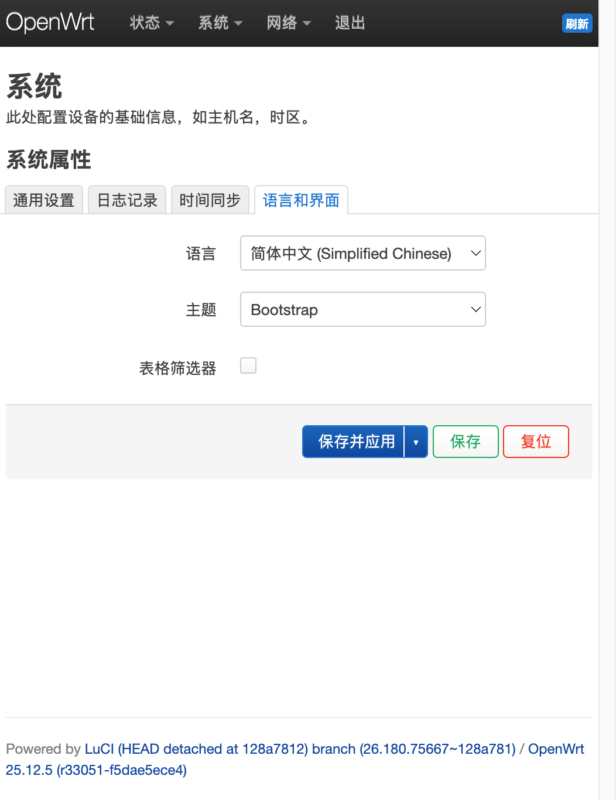
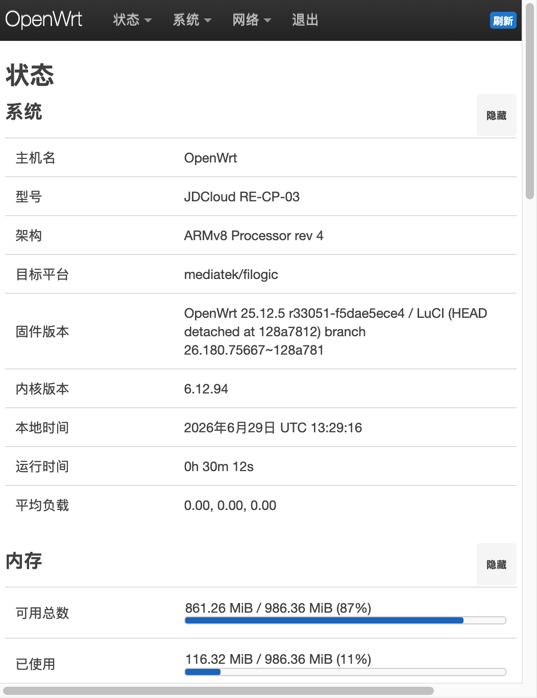
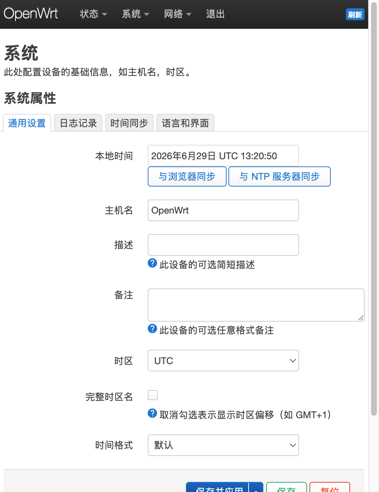

# 京东云 AX6000（RE-CP-03）OpenWrt 设置中文界面教程

> 本教程基于真机实操记录整理：京东云无线宝 AX6000（型号 RE-CP-03，联发科 Filogic 平台），
> 已刷入 **OpenWrt 25.12.5**。从确认设备状态开始，到界面完全汉化为止，全流程截图留档。

---

## 准备工作

- 一台电脑（本教程使用 Mac，Windows 用 PowerShell / PuTTY 同理）
- 电脑已通过网线或 Wi-Fi 连接到路由器的 LAN 侧
- 路由器管理密码（root 密码，下文统一写作 `<你的密码>`，请勿泄露真实密码）

---

## 第一步：确认路由器地址和连通性

在电脑终端执行：

```bash
ping 192.168.1.1
```

能收到回复说明电脑和路由器连通正常。再确认管理端口是否开放：

```bash
nc -z 192.168.1.1 22    # SSH 端口（命令行管理用）
nc -z 192.168.1.1 80    # 网页管理端口
```

两个端口都开放，说明既可以用网页（LuCI）操作，也可以用 SSH 操作。

> 如果路由器地址不是 192.168.1.1，Mac 上可以用 `route -n get default | grep gateway` 查询实际网关地址。

---

## 第二步：确认固件版本

SSH 登录路由器（首次登录会提示确认指纹，输入 yes）：

```bash
ssh root@192.168.1.1
# 提示输入密码时输入管理密码（输入时不显示，属正常）
```

登录后查看系统信息：

```bash
cat /etc/openwrt_release
```

本机实测输出：

```
DISTRIB_ID='OpenWrt'
DISTRIB_RELEASE='25.12.5'
DISTRIB_TARGET='mediatek/filogic'
DISTRIB_ARCH='aarch64_cortex-a53'
DISTRIB_DESCRIPTION='OpenWrt 25.12.5 r33051-f5dae5ece4'
```

**要点：OpenWrt 25.x 已改用 apk 包管理器**（老版本是 opkg），可以用下面的命令确认：

```bash
which opkg apk
```

本机只有 `/usr/bin/apk`，所以全程使用 apk 命令。

---

## 第三步：安装简体中文语言包

### 情况 A：路由器能正常上网（推荐）

```bash
apk update
apk add luci-i18n-base-zh-cn
```

也可以在网页界面操作：**System → Software → Update lists**，搜索 `luci-i18n-base-zh-cn` 点 Install。

> 繁体中文对应的包是 `luci-i18n-base-zh-tw`。

### 情况 B：路由器暂时无法上网（本次实操采用）

如果路由器 WAN 口没接网线、暂时联不了网，可以用电脑**代下载安装包再传进路由器**：

**1. 在电脑上查询官方源的包文件名**

打开 OpenWrt 官方下载站对应版本和架构的 luci 目录（目录列表可直接浏览）：

```
https://downloads.openwrt.org/releases/25.12.5/packages/aarch64_cortex-a53/luci/
```

找到中文包文件名，本次为：

```
luci-i18n-base-zh-cn-26.270.72870~a24d1f2.apk
```

**2. 下载到电脑**

```bash
curl -O https://downloads.openwrt.org/releases/25.12.5/packages/aarch64_cortex-a53/luci/luci-i18n-base-zh-cn-26.270.72870~a24d1f2.apk
```

**3. 上传到路由器 /tmp 目录**

```bash
scp -O luci-i18n-base-zh-cn-*.apk root@192.168.1.1:/tmp/
```

> 注意必须加 `-O` 参数：新版系统的 scp 默认走 SFTP 协议，而 OpenWrt 的 SSH 服务不带 SFTP 子系统，不加会报 `sftp-server: not found`。

**4. SSH 进路由器，本地安装**

```bash
ssh root@192.168.1.1
apk add --allow-untrusted /tmp/luci-i18n-base-zh-cn-*.apk
```

看到下面的输出即安装成功（开头的 wget 报错只是 apk 顺手刷新在线索引失败，不影响本地安装）：

```
(1/1) Installing luci-i18n-base-zh-cn (26.270.72870~a24d1f2)
OK: 24.3 MiB in 172 packages
```

---

## 第四步：把界面语言切换为中文

继续在 SSH 中执行：

```bash
uci set luci.main.lang=zh_cn
uci commit luci
```

> **易错点**：语言值是 `zh_cn`（下划线），不是 `zh-cn`（连字符）。写错会导致网页「语言和界面」下
> 拉框无法识别，显示为「自动」。

也可以在网页界面操作：登录后进入 **系统 → 系统 → 语言和界面**，语言下拉选择
**简体中文 (Simplified Chinese)**，点**保存并应用**。



---

## 第五步：验证效果

浏览器打开 `http://192.168.1.1`，登录页已显示中文（需要授权 / 用户名 / 密码 / 登录）：


登录后进入状态概览页，顶部菜单和系统信息全部中文化：



系统设置页面同样已是中文：



> 如果浏览器还显示英文，按 `Cmd + Shift + R`（Windows 为 `Ctrl + Shift + R`）强制刷新清缓存。

---

## 常见问题

| 问题 | 原因与解决 |
|------|-----------|
| `apk update` 报 `wget: Operation not permitted` | 路由器本身没联网。检查 WAN 口网线；或按第三步情况 B 离线安装 |
| `scp` 报 `sftp-server: not found` | 加 `-O` 参数使用兼容模式传输 |
| 语言下拉框显示「自动」而不是简体中文 | 配置值写成了 `zh-cn`，改为 `zh_cn` 后重新 commit |
| 装了语言包但某些插件页面还是英文 | 翻译是按模块分包的，还需装对应模块的翻译包，如 `luci-i18n-ddns-zh-cn` |
| 路由器 WAN 口无连接 | `ip link` 显示 eth1 为 NO-CARRIER，即 WAN 口网线未插或上级端口故障 |

---

## 附：本次实操环境

- 设备：京东云无线宝 AX6000（RE-CP-03）
- 固件：OpenWrt 25.12.5 r33051-f5dae5ece4（mediatek/filogic，内核 6.12.94）
- 操作电脑：Mac mini（macOS 27）
- 操作日期：2026-09-30
