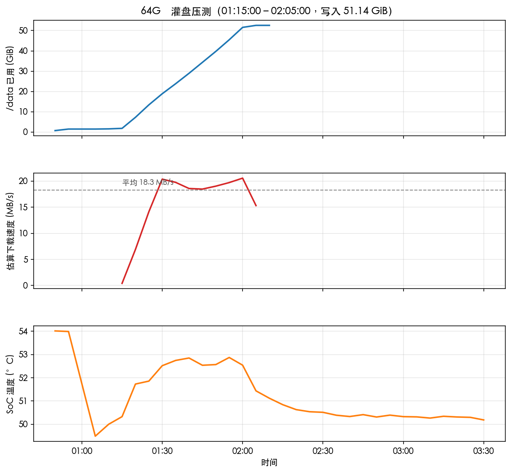
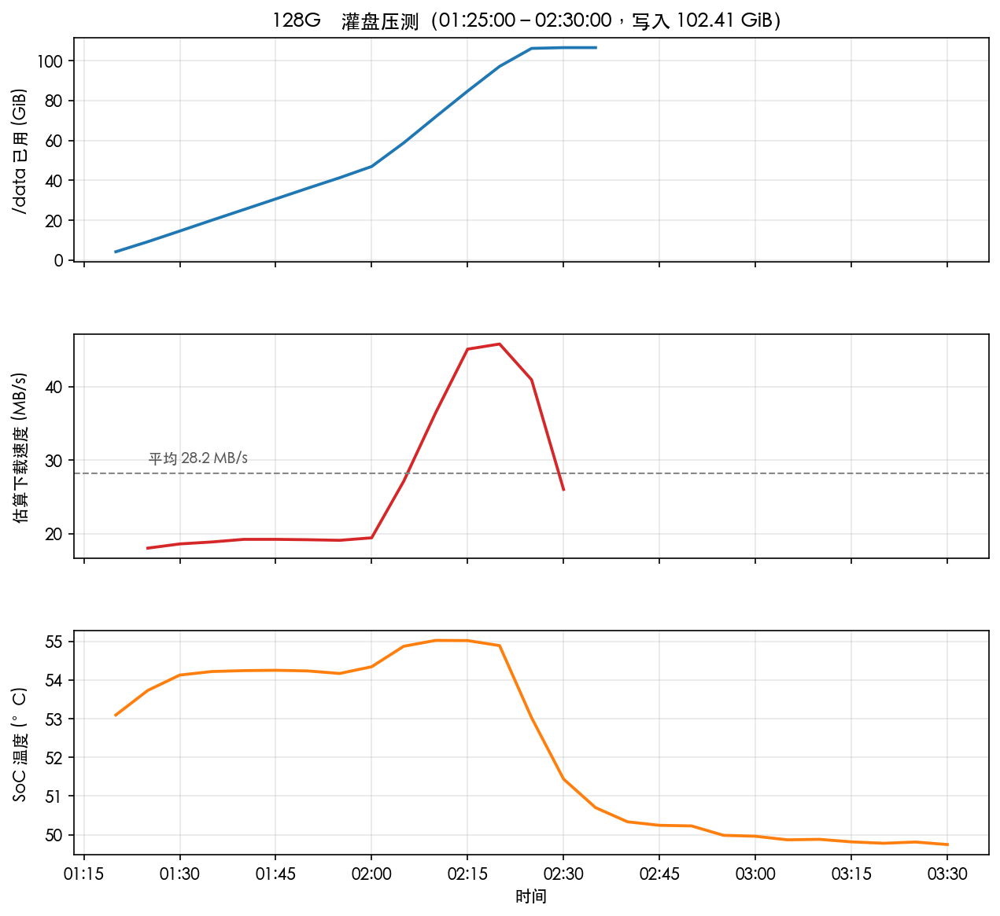
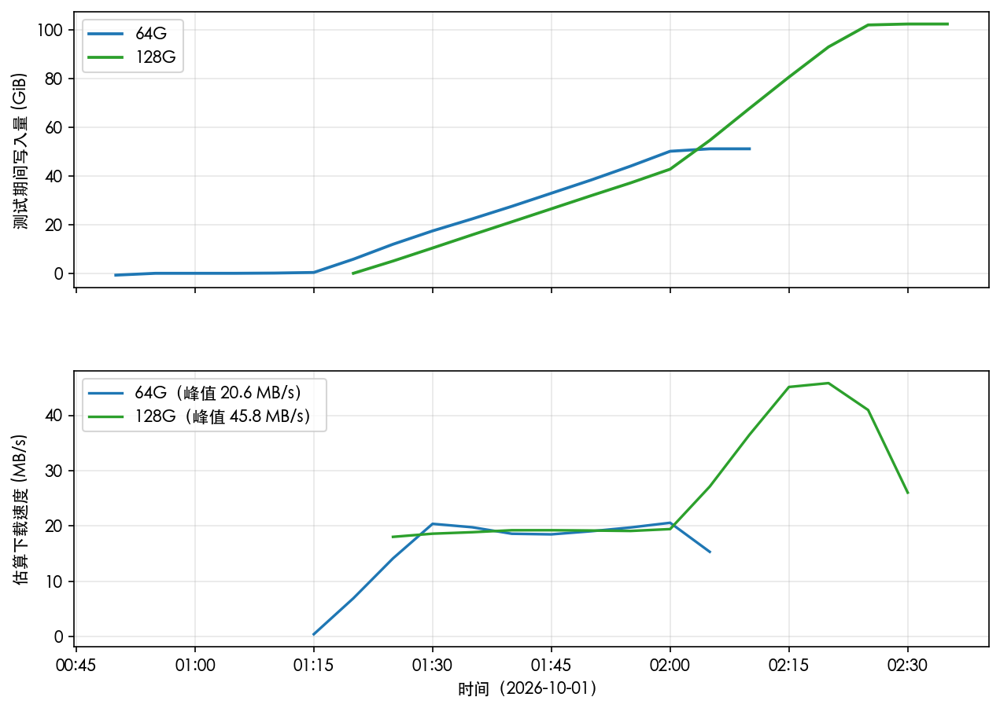

# 京东云 AX6000 双路由灌盘压测报告

> 测试日期：2026-10-01 凌晨　·　报告生成：2026-10-01 03:45 CST
> 填充文件全部为 **GPL 自由软件镜像**（Debian / openSUSE 官方 ISO）与
> **CC-BY 授权的 Blender 开源电影**，无盗版内容，可随时整体删除。

---

## 1. 测试背景与目的

- 两台京东云 AX6000（RE-CP-03）刷 OpenWrt 25.12.5 后，验证 eMMC 数据盘
  （/data）在**接近写满**状态下的网络 + 磁盘综合表现。
- 通过 aria2 批量下载大文件，把两台 /data 分别灌到约 95% 以上：
  - 64G 版目标 ≈ 52.6 GiB（55.4G 分区）
  - 128G 版目标 ≈ 106.8 GiB（112.4G 分区）
- 观测指标：下载吞吐、SoC 温度、eMMC 寿命计数、内核 I/O 错误。

## 2. 硬件与网络环境

| 项目 | 64G 版 | 128G 版 |
|---|---|---|
| eMMC | SLD64G，57.1 GiB（SLC 大厂颗粒） | SLD128，115 GiB |
| 角色 | 二级路由（WAN DHCP，挂 128G 下） | 主路由（PPPoE 拨号，SQM/CAKE 425M/80M） |
| LAN 网段 | 192.168.86.1 | 192.168.66.1 |
| 远程访问 | Tailscale 100.108.240.49 | 局域网 / Tailscale |
| 下载工具 | aria2 1.37（16 连接/任务，RPC 6800） | 同左 |
| 下载源 | 清华 TUNA 镜像 + Blender 官方 archive | 同左 |

## 3. 下载清单与总量

### 64G 版（01:15 – 02:05，全程约 50 分钟）

- Blender 开源电影 zip ×9（BBB 四档、TearsOfSteel 两档、Sintel 两档、
  Caminandes），合计约 4.6 GiB——**注意：电影包被重复入队下载了两次**
  （aria2 记录里同文件有两个 completed 条目，后一次覆盖前一次）。
- 完整 ISO ×8：Debian 13.7.0 amd64 / arm64 / armhf / ppc64el / riscv64
  DVD-1、openSUSE Leap 15.6、Debian source-DVD-1/2，合计约 33.5 GiB。
- 磁盘写满（100%）导致 5 个任务失败，留下部分片段：
  `debian-13.7.0-source-DVD-3/4/22.iso`、`Caminandes.GranDillama.mp4.zip`、
  `Sintel.HD.avi.zip`（失败原因均为 *Write disk cache flush failure*，
  即分区写满，属预期收尾现象，已从 aria2 记录清理）。
- **测试期间净写入 51.14 GiB**，结束时 /data 已用 52.6G / 55.4G = **100%**。

### 128G 版（01:25 – 02:30，全程约 65 分钟）

- Blender 开源电影 zip ×9，约 4.6 GiB。
- 完整 ISO ×22：Debian 13.7.0 六个架构 DVD-1、openSUSE Leap 15.6、
  Debian source-DVD-1..15，合计约 94.7 GiB。
- 磁盘写满导致 2 个任务失败（source-DVD-16/17，同样为写缓存刷盘失败，
  已清理记录，部分片段留在盘上）。
- **测试期间净写入 102.41 GiB**，结束时 /data 已用 106.6G / 112.4G = **100%**。

## 4. 速度、温度、磁盘曲线

数据来自两台 collectd rrd（5 分钟粒度，/data 用量差分估算写入速度）：







| 指标 | 64G 版 | 128G 版 |
|---|---|---|
| 测试窗口 | 01:15 – 02:05 | 01:25 – 02:30 |
| 净写入量 | 51.14 GiB | 102.41 GiB |
| 平均速度 | 18.3 MB/s（≈146 Mbps） | 28.2 MB/s（≈226 Mbps） |
| 峰值速度（5 分钟粒度） | 20.6 MB/s | 45.8 MB/s（02:05 后独享带宽时） |
| SoC 温度峰值 / 均值 | 52.9 / 52.2 °C | 55.0 / 54.1 °C |

**速度解读**：01:25–02:05 两台同时全速下载，合计约 40 MB/s（≈320 Mbps），
已逼近 128G 的 SQM 下行 425M  ceiling——**瓶颈在共享的宽带出口，不在路由
器本体**。02:05 64G 写满退出后，128G 立刻提速到 45 MB/s 以上，印证这一点。
64G 全程速度更低还与其二级路由 NAT 转发路径有关，属正常。

## 5. eMMC 健康结论

| 指标 | 64G 版 | 128G 版 | 判定 |
|---|---|---|---|
| life_time（A/B 区磨损） | 0x01 / 0x01 | 0x01 / 0x00 | 磨损 <10%，极佳 |
| pre_eol_info | 0x01 | 0x01 | 正常，无寿命预警 |
| dmesg I/O 错误 | 无 | 无 | — |

**结论**：约 154 GiB 的连续高强度写入后，两台 eMMC 寿命计数纹丝不动，
没有出现任何 I/O 错误、掉速或只读保护。京东云这两颗 eMMC（江波龙
SLD 系列）健康状况非常好，做下载机/轻量 NAS 没有寿命顾虑。

## 6. 稳定性结论

1. **满载温度温和**：SoC 峰值仅 55 °C，金属机身被动散热完全压得住，
   不需要外挂风扇。
2. **写满行为符合预期**：/data 到 100% 后 aria2 报 *Write disk cache
   flush failure* 退出，内核无 panic、无 remount-ro、无文件系统损坏，
   事后 df/读取均正常。
3. **网络并发稳定**：两台合计 30+ 个 aria2 任务、16 连接/任务的压力下，
   路由管理面（SSH/LuCI）全程可正常访问，未发生 OOM 或软重启
   （64G uptime 2.5h、128G uptime 5.3h 连续无重启）。
4. 小插曲：64G 在 00:43 曾重启一次 collectd（hostname 目录从 OpenWrt
   切到 jdcloud-64g），监控数据有一段换目录造成的空档，不影响结论。

## 7. 空间清理方法

填充文件随时可删，需要空间时：

```bash
# 两台路由器上执行（或从 Mac ssh 后执行）：
rm /data/downloads/*.iso                 # 释放约 133 GiB（两机合计）
rm /data/downloads/*.aria2               # 清理下载控制文件
# Blender 电影 zip（约 4.9 GiB/台）可保留，继续做 SMB 播放测试
```

删除 ISO 后（含失败留下的部分片段一并删则更干净），两台 /data 将回落至
约 12–14 GiB 用量（电影 zip + collectd 数据），继续用于 SMB 播放测试。

---

## 8. 后续收尾（同日 05:30 补充）

- **根因**：ext4 默认保留 5% 块给 root，真实用量约 95% 时 df 即显示 100%，
  失败任务的 .aria2 控制文件被写成 0 字节导致无法续传。
- **处理**：两台执行 `tune2fs -m 1 /dev/mmcblk0p6`（保留块降到 1%，数据盘
  无系统角色、保留块无意义），删除损坏残片后重新下载补齐。
- **最终落位**：64G 约 52.8G / 55.4G（**95.3%**）、128G 约 108G / 112.4G
  （**96.1%**），全部下载任务 complete，电影 zip 与解压版并存。
- **装机建议**：/data 分区格式化后顺手 `tune2fs -m 1`，把 5% 保留块还给
  可用空间（64G 约多出 2.2 GiB，128G 约多出 4.5 GiB）。

*附：本次分析脚本 `64G/analyze_stress.py`，原始 rrd 导出数据在 `64G/rrd/`。*
